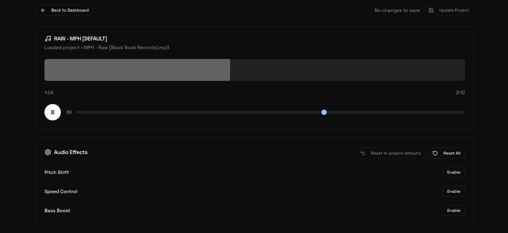

# Audio Processing Studio

Author: Alistair King

Email: [aking1@seas.upenn.edu](mailto:aking1@seas.upenn.edu)

## Description

This project is a web-based Audio Processing Studio. Users can upload their own audio files and manipulate them with a variety of controls in real time. The platform allows for saving projects to the cloud, so users can revisit and continue their work at any time. This application is built with a modern technology stack including [Next.js](https://nextjs.org/), [React](https://react.dev/), [Supabase](https://supabase.com/) for the backend and database, and [Tone.js](https://tonejs.github.io/) for powerful audio processing capabilities.

## Features

- **Audio Upload and Selection:** Upload your own audio files or choose from a selection of sample songs to get started quickly.
- **Parameter Control:** Fine-tune the audio-visual experience with a comprehensive set of controls for various audio effects.
- **Project Management:** Save your creations to the cloud. Your projects are automatically associated with your account, so you can access them anytime.
- **User Authentication:** Secure user authentication system for managing personal accounts and projects, powered by Supabase Auth.
<!-- - **Modern Tech Stack:** Built with Next.js for a fast and responsive user experience, Supabase for backend services, and a component-based architecture for maintainability. -->

## Assement Criteria

| Included| Criteria | Details |
|----------|--------------------|---------|
| ✅ | Components | The project is built with React and Next.js, with a component-based architecture. Components are located in the `components/` directory. |
| ✅ | Animations | The project uses `framer-motion` for UI animations like page transitions and list animations. It also uses `tailwindcss-animate` for subtle component animations. |
| ✅ | User registration / login / logout functionality | User authentication is implemented using Supabase Auth. The UI for sign-up, login, and password management is in `app/auth/`. |
| ✅ | Linking together a frontend framework with a backend framework (eg: React with Node) | Next.js is used as a full-stack framework. It renders React components on the server (Server Components) and on the client. |
| ✅ | Integration with database | The application uses Supabase's PostgreSQL database and storage buckets to store user data and audio projects. The files in `lib/supabase/` manage database interactions.  |
| ✅ | Classes and objects | While the project predominantly uses a functional programming style with React Hooks, it utilizes custom classes and objects such as the `PitchShifter` class which is used for real-time audio processing. |

## User Guide

The website is publicly accessible at [audio-reactive-cloud.vercel.app/](https://audio-reactive-cloud.vercel.app/).

Check out the video walkthrough of the project [here](https://drive.google.com/file/d/1xe7UChLOoBqa04WdxPFm34XOm6HUmLBj/view?usp=sharing).

More details can be found in the [User Guide](./USER_GUIDE.md).

## Future Directions
I spent around 5 hours to complete this project. I would like to add more features to the project in the future. Here are some ideas that I had:

- Add more audio effects, e.g. EQ, compression, reverb, delay, etc.
- Add more complex sound visualizations, e.g. 3D visualizations using [React Three Fiber](https://github.com/pmndrs/react-three-fiber).
- Export visualizations as video files.
- Real-time collaboration on projects.

---

## Credits
- This website was built on top of the [Next.js and Supabase Starter Kit](https://vercel.com/templates/authentication/supabase) by Vercel.
- The audio processing techniques used in this project were built on top of an original audio processing project I wrote as my final project for my CS class in senior year of high school. That project was a barebones version of this. Users could only upload files, but could not login and save projects. It lacked any animation or visualization. The code for this can be found in the `_old_audio_processor/` directory in [older versions of the project](https://github.com/aking526/audio-reactive-cloud/tree/8b5dda464bd32d81508a35be2e09cb0f1905a221/_old_audio_processor). (Note: this code is not production quality, it was a quick and dirty project to get the audio processing techniques working.)